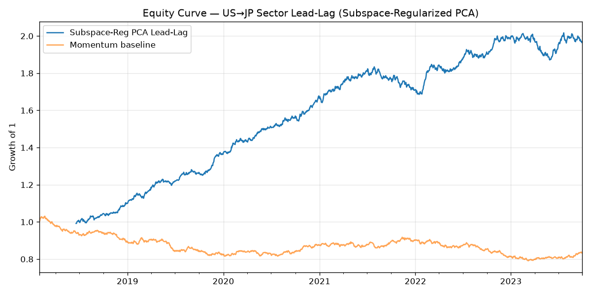

# 日米業種リードラグ投資戦略（部分空間正則化付きPCA）

論文 **「部分空間正則化付き主成分分析を用いた日米業種リードラグ投資戦略」**
（JSAI 金融情報学研究会 SIG-FIN, FIN-036, 2026, pp.76–83）の手法を **再構成** し、
バックテストとペーパーアカウント（仮想口座）でのテスト運用を行うためのリポジトリ。

> ⚠️ **重要な前提・免責**
> 1. 本実装が動作した環境では論文PDF本体（J-Stage）が **HTTP 403 で取得できなかった** ため、
>    公開アブストラクトと複数の詳細解説記事をもとに手法を **忠実に再構成** したものです。
>    数式・パラメータの細部は原論文と異なる可能性があります。
> 2. 同環境では **市場データの外部取得（Yahoo Finance 等）がネットワークでブロック** されているため、
>    リポジトリ同梱の実行結果は **リードラグ構造を仕込んだ合成データ** によるものです。
>    実データでの再現は、ネットワークが使えるローカル環境で `--source yfinance` を指定して実行してください。
> 3. 日本のセクターETFを扱える証券会社のペーパートレードAPIは実質存在しないため、
>    ペーパー運用は **自前のシミュレート仮想口座** で実装しています。
> 4. 本コードは研究・教育目的です。投資勧誘ではなく、将来の成果を保証しません。

---

## 1. 論文手法の要点

| 項目 | 内容 |
|---|---|
| **仮説（リードラグ）** | 米国市場（東京時間早朝にクローズ）で確定した情報が、翌朝9時に開く日本市場へ遅延伝播する |
| **入力（説明変数）** | 米国セクターETFの **当日 終値→終値** リターン `us_cc[t]` |
| **予測対象** | 日本セクターETFの **翌日 始値→終値** リターン `jp_oc[t+1]` |
| **中核手法** | 日米 **結合相関行列** に対する **部分空間正則化付きPCA** |
| **事前部分空間** | `global`（全銘柄等ウェイト＝市場全体）／`country_spread`（米+ / 日−＝日米格差） |
| **正則化** | 経済的に意味のある事前部分空間へ **強い縮小（λ=0.9）** をかけ短窓推定を安定化 |
| **ポートフォリオ** | 予測リターンを横断デマーン→ドルニュートラルのロング・ショート |
| **論文報告値** | 年率リターン ≈ **23.8%** / リスクリワード **2.22** / 最大DD **9.58%**（単純モメンタム5.6%を大幅に上回るα） |

### リードラグ・シグナルの実装（`src/signal.py`）

1. 過去窓について、米国当日 `us_cc[i]` と翌日日本 `jp_oc[i+1]` を連結した結合サンプルを標準化して作る
2. 結合相関行列に部分空間正則化付きPCAをかけ、安定な因子ローディング `W = [W_us; W_jp]` を得る
3. 予測日 `t` では米国当日リターンのみ観測可能。最小二乗で因子スコアを復元し、日本側を再構成：

   ```
   f̂ = argmin_f ‖ W_us · f − z_us(t) ‖,    r̂_jp(t+1) = W_jp · f̂
   ```

   これは「米国終値のセクター相対強弱ベクトルを、共通因子を介して翌朝の日本へ写像する」機構の実装。

### 部分空間正則化付きPCA（`src/pca.py`）

相関行列 `S` と事前部分空間への射影子 `P` に対し、

- `shrink`（既定）: `S_reg = (1−λ)·S + λ·(P S P)` — λ→1 で因子を事前部分空間へ完全に縮小
- `penalty`: `S_reg = S + λ·(trS/n)·P` — データ駆動成分を残したまま事前方向を安定化

を構成し、上位固有ベクトルを因子ローディングとする。

---

## 2. セットアップ

```bash
pip install -r requirements.txt
# 実データ再現にはローカルで追加: pip install yfinance
```

## 3. バックテスト

```bash
# (A) 合成データ（ネットワーク不要・このリポジトリの既定）
python scripts/run_backtest.py --source synthetic

# (B) 実データ（ローカル・要 yfinance + ネットワーク）
python scripts/run_backtest.py --source yfinance --start 2018-01-01
```

出力（`results/`）: 日次リターン・エクイティ・指標CSV、`equity_curve.png`。

### 合成データでの実行結果（既定パラメータ λ=0.9, factors=4, window=120, cost=5bps）

```
===== 戦略: 部分空間正則化付きPCA リードラグ =====
  年率リターン      :  12.56 %
  年率ボラティリティ:   5.84 %
  リスクリワード R/R:   2.15
  最大ドローダウン  :  -8.11 %
  勝率(日次)        :  55.40 %
===== ベースライン: 単純モメンタム =====
  リスクリワード R/R:  -0.55   （最大DD -23.28%）
```



合成データはリードラグ構造の **S/N比を調整** し、**リスクリワード R/R≈2.15・最大DD≈−8%**
が論文報告（2.22 / −9.58%）に近い regime になるよう較正しています。
**絶対リターン（年率）は R/R × ボラティリティであり、ボラ目標やレバレッジという自由なスケールに依存** するため、
論文の23.8%という水準は較正対象にしていません（合成データに本質的な意味はありません）。
論文の絶対値の再現は実データ（`--source yfinance`）で検証してください。

### λ（正則化強度）アブレーションについての正直な注記

合成データ上では `shrink` variant で λ を上げるほど R/R が必ずしも改善しません。理由は2つ:

1. 合成データは定常な因子構造でノイズも低いため、論文が問題視する
   **「短窓での固有ベクトルの不安定性」が強く現れない** → 正則化の安定化効果が出にくい。
2. 本戦略は **日本業種を横断デマーンするドルニュートラル** であり、事前部分空間の2方向
   （`global`＝全業種で一定、`country_spread`＝日本ブロック内で一定）は **横断方向に定数** で、
   デマーンで消えてしまう。`shrink` で強く縮小すると業種ローテーション信号まで削がれる。

したがって **正則化の真価は（不安定性が顕著な）実データで判定すべき** です。データ駆動成分を残す
`--variant penalty` は λ に対して頑健（R/R≈2.1 で安定）で、横断戦略には素直に効きます。
`scripts/run_backtest.py` の `--lam` / `--variant` で各自検証できます。

## 4. ペーパーアカウント（仮想口座）でのテスト運用

```bash
# (A) 直近 n 日を一括シミュレーション（デモ/検証）
python scripts/run_paper_trading.py --mode simulate --days 60 --initial 1000000

# (B) 日次ステップ（cron等で毎営業日呼ぶ。状態は state/ に永続化）
python scripts/run_paper_trading.py --mode daily
```

- 仮想資金（既定 ¥1,000,000）で、毎営業日 **米国終値→日本翌日予測→翌寄りでリバランス→引けでマーク** を実行
- 口座状態（現金・建玉・履歴・直近ウェイト）を `state/paper_account.json` に永続化
- `--mode daily` を日次cronに登録すれば、前向きのペーパー運用ログが蓄積されます

> 前向きの短いスライス（数十〜数百日）は regime 差でフルサンプルのバックテスト（R/R 2.15）と
> 乖離します。これは戦略の正常な性質です。

### 実ブローカー接続

`src/paper_trading.py` の `BrokerAdapter` を実装して差し替えれば実口座に接続できます。
米国ETFで回す場合の参考として Alpaca ペーパー口座の雛形 `AlpacaPaperBroker` を同梱
（環境変数 `APCA_API_KEY_ID` / `APCA_API_SECRET_KEY`、要 `pip install alpaca-py`）。
**日本セクターETFは Alpaca 非対応** のため、実運用では国内証券のAPI等に置き換える前提です。

## 5. テスト

```bash
python -m pytest tests/ -q     # 6 件: 直交性・λ極限・ニュートラル性・リーク無し・正のα 等
```

リーク防止（`tests/test_strategy.py::test_no_lookahead...`）: 予測関数は過去窓と当日米国リターン
のみを使い、未来の日本リターンを汚染しても予測が不変であることを検証しています。

## 6. ディレクトリ構成

```
src/
  config.py         ETFユニバース・戦略パラメータ
  data.py           合成データ生成器 + yfinance 実データアダプタ
  pca.py            部分空間正則化付きPCA
  signal.py         リードラグ予測シグナル
  backtest.py       ロング・ショート・バックテスター + 指標 + モメンタムBaseline
  paper_trading.py  仮想口座エンジン + Alpaca雛形
scripts/
  run_backtest.py
  run_paper_trading.py
tests/test_strategy.py
results/            バックテスト出力
state/              ペーパー口座の永続状態
```

## 7. 参考

- 論文: [部分空間正則化付き主成分分析を用いた日米業種リードラグ投資戦略](https://www.jstage.jst.go.jp/article/jsaisigtwo/2026/FIN-036/2026_76/_article/-char/ja/)（JSAI SIG-FIN FIN-036, 2026）
- 基礎手法: [事前エクスポージャー情報を活用した部分空間正則化付き主成分分析](https://www.jstage.jst.go.jp/article/jsaisigtwo/2025/FIN-035/2025_108/_article/-char/ja/)（FIN-035, 2025）
